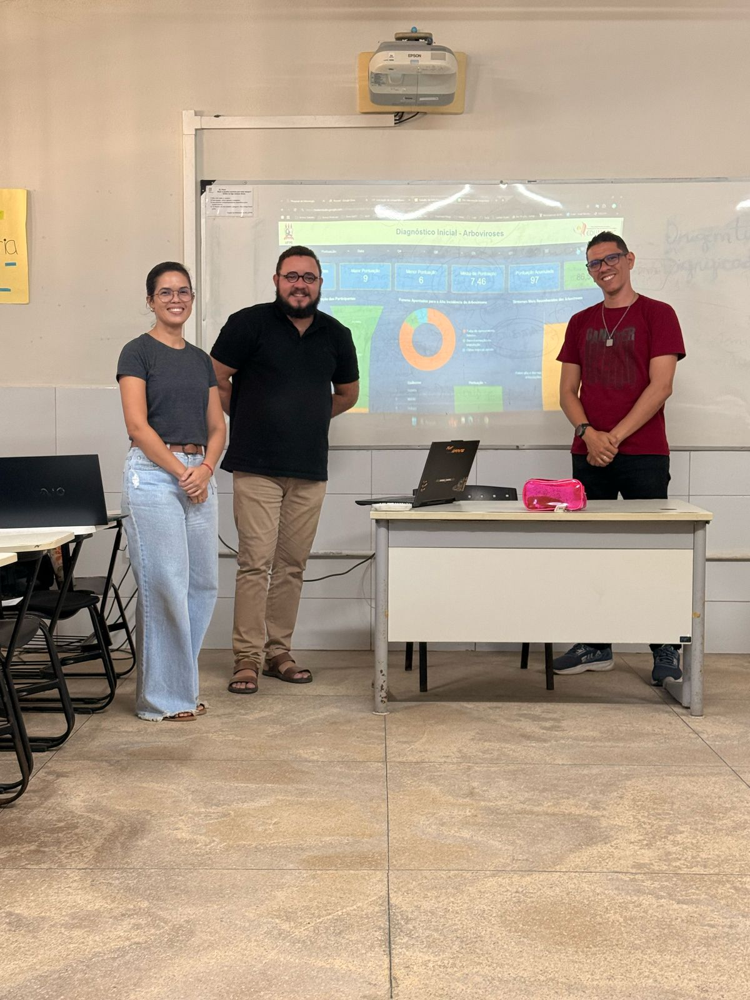
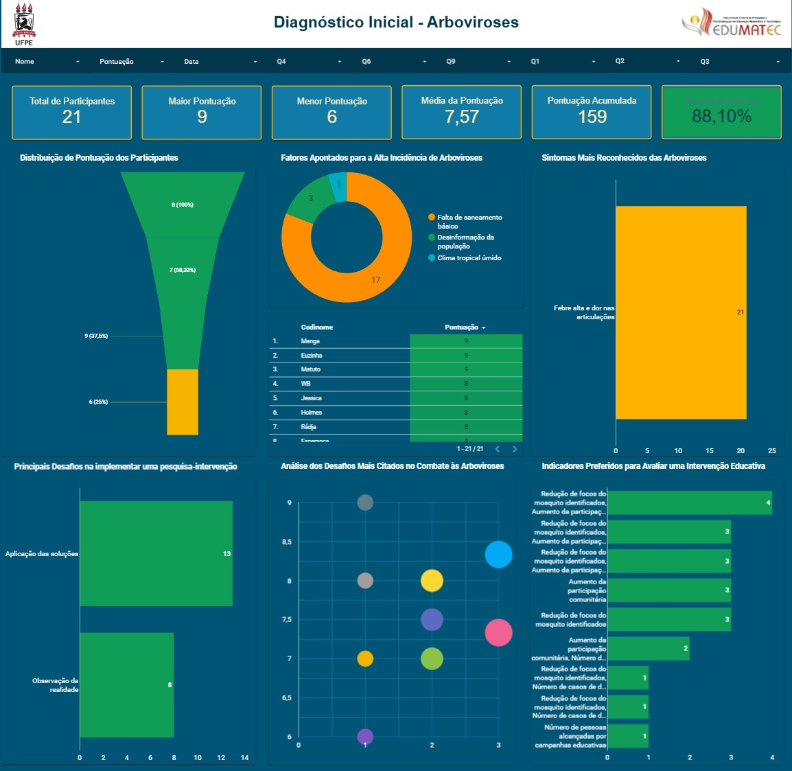

---

# 📚 Projeto de Intervenção Educacional: Arboviroses

## 👥 Equipe

* **Israel Monteiro**
* **Robson Muniz**
* **Janaíres Silva**

### 👥 Foto da Equipe

  
*(Foto da equipe: [Clique aqui](../images/foto_equipe.png))*

---

## 🎯 Tema: Prevenção de Arboviroses em Ambiente Educacional

O projeto teve como foco a **realização de uma intervenção educativa sobre arboviroses**, abordando temas como Dengue, Zika e Chikungunya, com o objetivo de promover a conscientização e mudança de comportamento entre os participantes.

---

## ✅ Objetivos da Intervenção

* Sensibilizar os participantes sobre a importância da prevenção das arboviroses.
* Promover mudanças de atitudes por meio de atividades educativas.
* Mensurar o impacto da intervenção por meio de coleta e análise de dados.

---

## 🧰 Metodologia Aplicada

Utilizamos uma abordagem inspirada no **Arco de Maguerez**, combinando **reflexão e ação**.

### Etapas Realizadas:

1. **Diagnóstico Inicial:**

   * Aplicação de um formulário online (Google Forms) para levantamento de conhecimentos prévios dos participantes.

    
  (Visualização: [Dashboard Looker Studio](../images/dashboard_resultado.png))

2. **Intervenção Educativa:**

   * Apresentação de conteúdos sobre arboviroses.
   * Discussão sobre práticas preventivas.
   * Atividades interativas com os participantes.

3. **Pós-Intervenção:**

   * Aplicação de um segundo formulário para avaliar o ganho de conhecimento.
   * Análise comparativa dos dados pré e pós-intervenção.

---

## 📈 Instrumentos de Coleta de Dados

* **Google Forms:** Para diagnóstico e avaliação de resultados.
* **Looker Studio (Google Data Studio):** Para visualização gráfica dos dados coletados.

---

## 📝 Considerações Finais

A experiência com a pesquisa de intervenção foi extremamente rica, permitindo a aplicação prática dos conceitos discutidos em sala, como:

* Definição de problema de pesquisa
* Construção de objetivos específicos
* Escolha de instrumentos de coleta
* Análise de impacto educacional

Além disso, a temática das **arboviroses** reforçou o compromisso social da pesquisa, alinhando saúde e educação.

---

## 📎 Links e Anexos

* 📷 Foto da equipe: [Clique aqui](../images/foto_equipe.png)
* 📈 Dashboard Looker Studio: [Acessar Dashboard](https://lookerstudio.google.com/u/0/reporting/e8dd73e5-4e53-4e56-b3fc-d677c0e55a58/page/p_zedphu4m7c)
* 📑 Apresentação original: [Download do arquivo PPTX](../Trabalho%20de%20metodologia.pptx)

---

